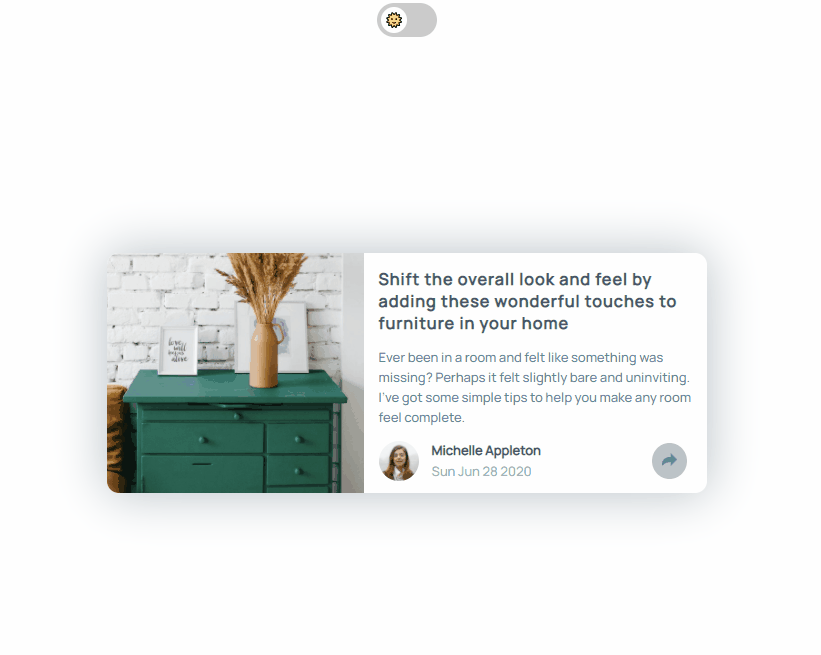

# article-preview

Component made for the [Frontend Mentor](https://www.frontendmentor.io/) Article preview component challenge

Try the challenge out for yourself: [Article preview component](https://www.frontendmentor.io/challenges/article-preview-component-dYBN_pYFT)

Live: [https://saulmaldonado.github.io/article-preview/](https://saulmaldonado.github.io/article-preview/)

## Preview



## Install

```bash
npm install @saulmaldonado/article-preview
```
or
```bash
 yarn add @saulmaldonado/article-preview
```

## Props

```ts
type Props = {
  title: string;
  subtitle: string;
  image: string;
  author: string;
  profilePicture: string;
  datePosted: Date;
  socialLinks: SocialLinks;
  dark?: boolean;
};

type SocialLinks = {
  twitter?: string;
  facebook?: string;
  pinterest?: string;
  facebookMessenger?: string;
  linkedin?: string;
  reddit?: string;
};
```

## Usage

```tsx
import React, { Component } from 'react';

import ArticlePreview from 'article-preview';
import 'article-preview/dist/index.css';

const socialLinks = {
  facebook: 'https://facebook.com',
  pinterest: 'https://pinterest.com',
  twitter: 'https://twitter.com',
  reddit: 'https://reddit.com',
  facebookMessenger: 'https://messenger.com',
  linkedin: 'https://linkedin.com',
};

const Example = () => {
    return (
      <ArticlePreview
        dark={darkMode}
        title='  Shift the overall look and feel by adding these wonderful
  touches to furniture in your home'
        subtitle='Ever been in a room and felt like something was missing? Perhaps
      it felt slightly bare and uninviting. I’ve got some simple tips
      to help you make any room feel complete.'
        author='Michelle Appleton'
        datePosted={new Date('28 Jun 2020')}
        image={image}
        profilePicture={profilePicture}
        socialLinks={socialLinks}
      />
    );
  }
}
```

## License

MIT © [saulmaldonado](https://github.com/saulmaldonado)
